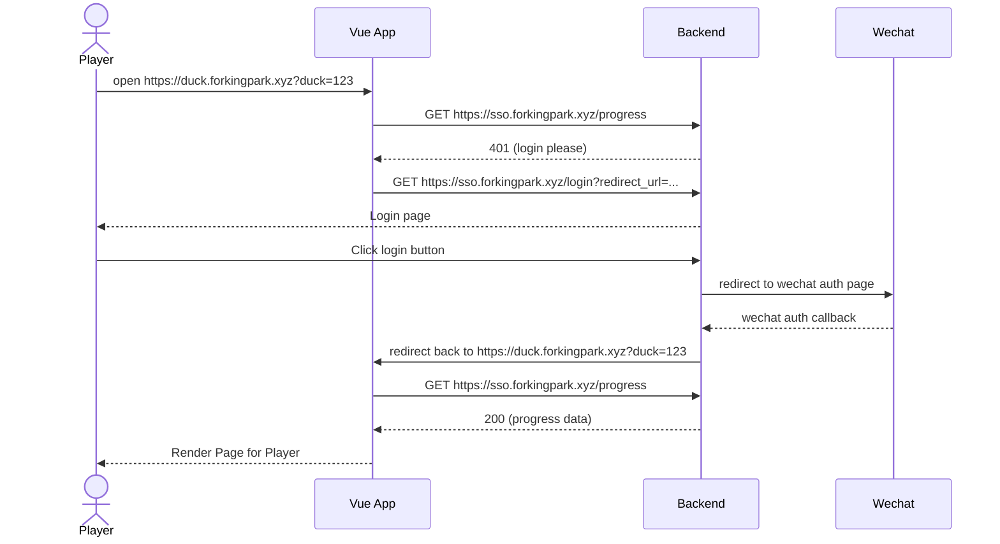

# 登陆及其他

这个项目是鸭鸭后端代码：提供登陆及玩家进度。

- 前端网址：`https://duck.forkingpark.xyz`
- 后端网址：`https://sso.forkingpark.xyz`

## 前端与后端的交互

### 有效登陆session

- 浏览器打开`https://duck.forkingpark.xyz`（网站首页）
  1. 展示地图
  2. 请求用户进度
  3. 刷新鸭鸭状态

- 浏览器打开`https://duck.forkingpark.xyz?duck_id=xxxxxxxxx`（鸭子二维码网址）
  1. 展示地图
  2. 请求后端标注该鸭鸭已被查看，后端返回更新后的进度，
  3. 刷新鸭鸭状态、打开新鸭鸭卡片

- 应用内扫描二维码获得链接`https://duck.forkingpark.xyz?duck_id=xxxxxxxxx`
  1. 从URL提取鸭鸭ID（不跳转网页，以保留地图缩放及位置状态）
  2. 请求后端标注该鸭鸭已被查看，后端返回更新后的进度
  3. 刷新鸭鸭状态、打开新鸭鸭卡片

### 未登陆状态

未登陆状态下，请求更新进度或获取当前进度都会收到401，
此时需要跳转用户到后端提供的登陆页面，详见后端接口。

## 后端接口

### 获取进度

```GET https://sso.forkingpark.xyz/api/progress```

#### 响应
成功状态(200)

```json
{
  "ducks_found": [
    "duck-id-1",
    "duck-id-2",
    "duck-id-3"
  ]
}
```

未登陆(400)
```text
login please
```

### 发现新鸭子

```POST https://sso.forkingpark.xyz/api/duck```

body

```json
{
  "duck_id": "duck-id"
}
```

#### 响应
- 成功状态(200)
```json
{
  "duck_scanned": "duck-id-3",
  "ducks_found": [
    "duck-id-1",
    "duck-id-2",
    "duck-id-3"
  ]
}
```
- 鸭子ID不存在(404)
- 未登陆(401)

### 登陆

```GET https://sso.forkingpark.xyz/login?redirect_url=登陆前本来想访问的URL```

例子
```https://sso.forkingpark.xyz/login?redirect_url=https%3A%2F%2Fduck.forkingpark.xyz%3Fduck_id%3Dxxxxxxxxx```

在登陆完成后会将用户跳转回`https://duck.forkingpark.xyz/duck_id=xxxxxxxxx`

#### 响应
html登陆页

#### 登陆流程



login page 由后端处理。前端负责以下逻辑：
请求如果遇到401，则POST到
